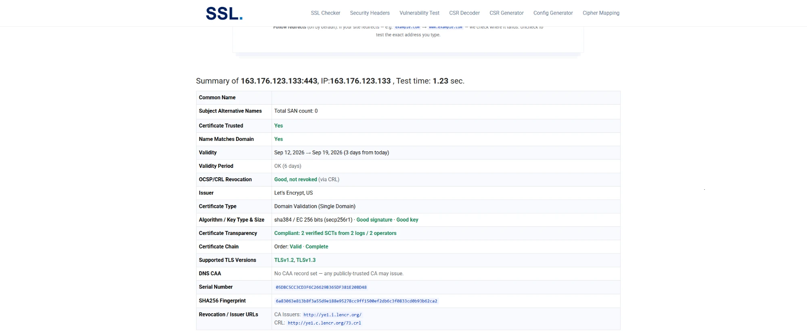
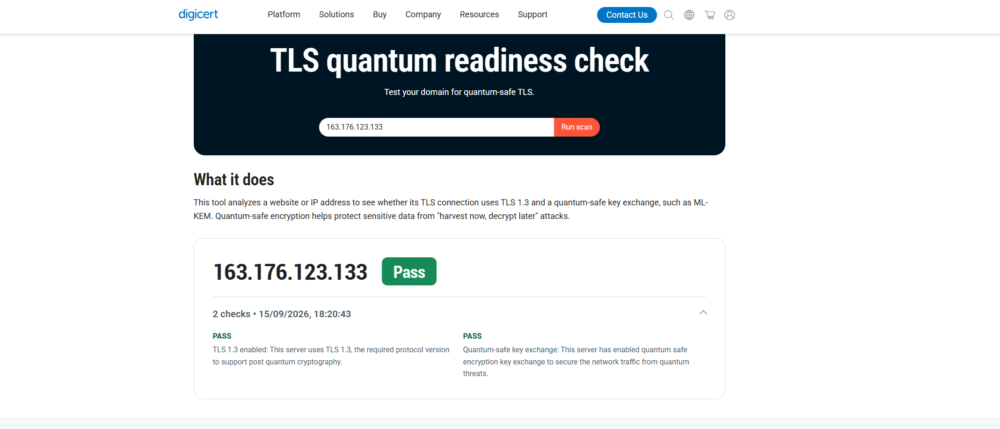
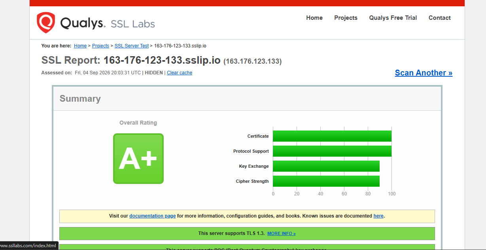

# Projeto Aplicado: Práticas de Mercado — Protótipo Web Seguro

Protótipo de aplicação web desenvolvido sob os princípios **Secure by Design** e
**Secure by Default**, integrando os três eixos da disciplina:

- ☁️ **Eixo 1 — Infraestrutura:** VM Ubuntu na Oracle Cloud (Free Tier), Nginx, HTTPS.
- 📦 **Eixo 2 — Repositório:** GitHub público, `.gitignore` blindado, sem credenciais versionadas.
- 💻 **Eixo 3 — Desenvolvimento:** app Flask (Python) com login, área interna e logout.
- 🔄 **CI/CD:** GitHub Actions faz o deploy automático a cada `git push origin main`.

> Este README é o relatório técnico da entrega.

> **Codificação assistida por IA:** todo o código, a auditoria de segurança e a
> configuração de infraestrutura foram desenvolvidos com o auxílio de um
> assistente de IA (fluxo equivalente ao proposto pela IDE Antigravity),
> incluindo geração de código seguro, depuração e refatoração.

### 🔗 Aplicação no ar

| Recurso | Endereço |
|---|---|
| Aplicação (IP público) | https://163.176.123.133 |
| Aplicação (hostname p/ teste TLS) | https://163-176-123-133.sslip.io |
| Repositório | https://github.com/scarloseduardopereira-star/projetoaplicado |

### 🏆 Evidências de TLS/PQC

A entrega é por **IP público**, portanto a validação principal segue o **caminho IP**
da atividade (SSL.org + DigiCert). Como reforço, incluímos também o **caminho Domínio**
(Qualys SSL Labs) via hostname.

#### ✅ Caminho IP (validação principal — `163.176.123.133`)

**1. SSL.org — SSL Certificate Checker** · https://www.ssl.org/
- **Certificate Trusted: YES**
- **Algorithm / Key Type & Size: Good signature · Good key** (ECDSA P-256 / SHA-384)
- Emissor: **Let's Encrypt** · TLS 1.2 e 1.3



**2. DigiCert — TLS Quantum Readiness Check (PQC)** · https://www.digicert.com/pqc-checker
- **PASS** — *TLS 1.3 enabled*
- **PASS** — *Quantum-safe key exchange* (ML-KEM / `X25519MLKEM768`)



#### ➕ Caminho Domínio (reforço — Qualys SSL Labs)

Relatório ao vivo: **https://www.ssllabs.com/ssltest/analyze.html?d=163-176-123-133.sslip.io**
- **Overall Rating: A+** · suporte a PQC (`X25519MLKEM768`) · HSTS ativo



> O teste do SSL Labs não avalia endereços IP diretamente; por isso o caminho Domínio
> usa o hostname `163-176-123-133.sslip.io`, que resolve para o mesmo IP
> (`163.176.123.133`) e usa a mesma configuração TLS. Nenhum domínio foi registrado.

---

## 0. Sobre o projeto (conceito)

### Do que se trata

Este projeto simula o **ciclo de vida completo** de uma aplicação web moderna em um
cenário de mercado real: escrever o código, versioná-lo, publicá-lo em nuvem pública
e mantê-lo em produção — **com segurança em cada etapa**, e não como um remendo no fim.

A ideia central é demonstrar dois princípios:

- **Secure by Design** — a segurança faz parte da arquitetura desde o primeiro
  commit (controle de acesso, hash de senha, proteção CSRF, cabeçalhos de segurança).
- **Secure by Default** — a configuração padrão já é a mais segura possível: o app
  se recusa a iniciar sem segredos definidos, o cookie de sessão já nasce protegido,
  o servidor só aceita TLS moderno e só abre as portas estritamente necessárias.

### Como funciona (em uma frase)

O usuário acessa a aplicação por HTTPS; faz **login** (senha verificada por hash
Argon2, com proteção contra força bruta e CSRF); é levado a uma **página interna**
que só existe para quem está autenticado; e pode sair pelo **logout**, que encerra a
sessão. Por trás, o Nginx faz a criptografia TLS (com troca de chave pós-quântica) e
repassa as requisições ao aplicativo Python rodando sob o Gunicorn.

### Linguagem e por que foi escolhida

- **Linguagem:** **Python 3** &nbsp;·&nbsp; **Framework:** **Flask**.
- **Motivo:** o Flask entrega os controles de segurança exigidos com pouquíssimo
  código e uma superfície de ataque pequena — CSRF, sessão, cabeçalhos/HSTS, hash
  forte e rate limiting saem de bibliotecas maduras e bem auditadas, o que torna a
  mitigação das categorias OWASP direta e fácil de comprovar. Não exige banco de
  dados (requisito dispensado), mantendo o protótipo enxuto.

### Configuração em alto nível

1. **Infra (nuvem):** VM Ubuntu 26.04 na Oracle Cloud, endurecida (SSH só por chave,
   Fail2Ban, firewall mínimo), com Nginx + Certbot (HTTPS/PQC).
2. **Código:** app Flask servido pelo Gunicorn; segredos em variáveis de ambiente
   (arquivo `.env`, nunca versionado).
3. **Automação:** GitHub Actions publica em produção a cada `git push origin main`,
   usando uma chave SSH guardada em GitHub Secrets.

> As seções seguintes detalham cada eixo, com evidências e apontamentos no código.

---

## 1. Visão geral da aplicação

App mínimo em **Python + Flask**. Sem banco de dados: um único usuário é definido
por variáveis de ambiente (usuário + hash Argon2 da senha). Três telas/rotas:

| Rota        | Método   | Descrição                                              |
|-------------|----------|--------------------------------------------------------|
| `/login`    | GET/POST | Tela de login (formulário com token CSRF)              |
| `/interna`  | GET      | Página interna — **só acessível autenticado**          |
| `/logout`   | POST     | Encerra a sessão (POST + CSRF, evita logout forçado)   |
| `/healthz`  | GET      | Checagem de disponibilidade (usada no deploy/CI)       |

### Estrutura do projeto

```
tcc/
├── app.py               # aplicação Flask
├── templates/
│   ├── login.html       # tela de login
│   └── interna.html     # página interna protegida
├── static/style.css
├── generate_hash.py     # gera o hash Argon2 da senha
├── requirements.txt
├── .gitignore           # impede versionar .env, chaves, DBs
├── .env.example         # modelo de configuração (sem segredos reais)
└── README.md
```

### Pilha tecnológica

| Camada              | Ferramenta        | Papel                                         |
|---------------------|-------------------|-----------------------------------------------|
| Linguagem/framework | Python 3 / Flask  | Servir páginas e lógica                       |
| Autenticação/sessão | Flask-Login       | Sessão e proteção de rotas                    |
| Hash de senha       | argon2-cffi       | Armazenamento seguro da credencial            |
| CSRF                | Flask-WTF         | Token anti-CSRF em todo POST                  |
| Headers/HSTS/HTTPS  | Flask-Talisman    | Cabeçalhos de segurança, HSTS, CSP            |
| Rate limiting       | Flask-Limiter     | Limita tentativas de login (anti brute force) |
| Servidor WSGI (prod)| Gunicorn          | Executa o app atrás do Nginx                  |

---

## 2. Mitigação da OWASP Top 10:2025 (Eixo 3)

A aplicação mitiga ativamente **3 categorias** da
[OWASP Top 10:2025](https://owasp.org/Top10/2025/). Abaixo, o quê, onde e como.

### ✅ A01 — Broken Access Control

**Onde:** `app.py`, rota `interna()` — decorador `@login_required`.

**Como:** a página interna é protegida pelo Flask-Login. Qualquer requisição sem
sessão válida é redirecionada para `/login` (HTTP 302), sem jamais expor o
conteúdo protegido. O logout invalida a sessão, e o acesso posterior à área
interna volta a ser bloqueado.

```python
@app.route("/interna")
@login_required  # bloqueia acesso não autenticado
def interna():
    return render_template("interna.html", user=current_user.id)
```

### ✅ A07 — Authentication Failures

**Onde:** `app.py`, rota `login()` + configuração de sessão + `generate_hash.py`.

**Como (várias camadas):**
- **Senha nunca em texto puro** — armazenada apenas como hash **Argon2**
  (`argon2-cffi`), algoritmo vencedor do Password Hashing Competition.
- **Rate limiting** — `@limiter.limit("5 per minute")` no POST de login corta
  ataques de força bruta (retorna HTTP 429 ao estourar).
- **Mensagem de erro genérica** — "Usuário ou senha inválidos" não revela se o
  usuário existe (evita enumeração de contas).
- **Cookie de sessão endurecido** — `HttpOnly` (inacessível a JS),
  `SameSite=Lax`, e `Secure` em produção (só trafega sob HTTPS). Sessão expira
  em 30 minutos.

### ✅ A02 — Security Misconfiguration

**Onde:** `app.py`, bloco de configuração do `Talisman` e `app.config`.

**Como:** o Flask-Talisman aplica, por padrão, uma configuração endurecida:
- **HSTS** (`Strict-Transport-Security`, 1 ano, includeSubDomains) força o
  navegador a só usar HTTPS.
- **Content-Security-Policy** restritiva (`default-src 'self'`, sem inline
  script/style, `object-src 'none'`, `frame-ancestors 'none'`).
- **X-Frame-Options: DENY** (anti-clickjacking) e **X-Content-Type-Options:
  nosniff**.
- **Redirecionamento forçado para HTTPS** em produção.
- **Sem segredos hardcoded** — `SECRET_KEY` e `APP_PASSWORD_HASH` vêm do
  ambiente; o app **recusa iniciar** com valores padrão inseguros.

> **Defesa extra (bônus):** proteção **CSRF** via Flask-WTF em todos os POSTs
> (login e logout). POST sem token válido é rejeitado com HTTP 400.

### Evidências dos testes

| Cenário testado                          | Resultado esperado | Obtido |
|------------------------------------------|--------------------|--------|
| Login válido                             | 302 → `/interna`   | ✅ 302 |
| Acesso a `/interna` sem login            | 302 → `/login`     | ✅ 302 |
| Logout                                   | 302 → `/login`     | ✅ 302 |
| `/interna` após logout                   | 302 → `/login`     | ✅ 302 |
| POST login sem token CSRF                | 400                | ✅ 400 |
| 6+ logins/minuto                         | 429 (rate limit)   | ✅ 429 |

---

## 3. Como executar localmente

Pré-requisitos: **Python 3.11+**.

```bash
# 1. criar e ativar ambiente virtual
python -m venv .venv
# Linux/macOS:
source .venv/bin/activate
# Windows (PowerShell):
.venv\Scripts\Activate.ps1

# 2. instalar dependências
pip install -r requirements.txt

# 3. configurar segredos (NUNCA versionar o .env)
cp .env.example .env
python -c "import secrets; print('SECRET_KEY=' + secrets.token_hex(32))"   # cole no .env
python generate_hash.py                                                     # cole o APP_PASSWORD_HASH no .env

# 4. rodar
python app.py
# acesse http://127.0.0.1:5000
```

Login de exemplo: usuário `admin` + a senha definida no passo 3.

---

## 4. Infraestrutura — Eixo 1 (Oracle Cloud Free Tier)

- **Provedor:** Oracle Cloud Infrastructure, Free Tier (região sa-saopaulo-1).
- **Instância:** shape `VM.Standard.E2.1.Micro` (Always Free), 1 OCPU / 1 GB.
- **Sistema operacional:** **Ubuntu Server 26.04 LTS** (OpenSSL 3.5.5).
- **IP público:** `163.176.123.133` (reserved public IP).
- **Servidor web:** **Nginx 1.28** como proxy reverso → Gunicorn (127.0.0.1:8000).
- **Aplicação em produção:** https://163.176.123.133

### Endurecimento e metas de segurança

| Meta obrigatória | Implementação | Evidência |
|---|---|---|
| Acesso remoto só por chave SSH | `PasswordAuthentication no`, chave ed25519 | `sshd -T` |
| Fail2Ban na porta 22 | jail `sshd`, `maxretry=4`, `bantime=86400` (24h) | `fail2ban-client status sshd` |
| Firewall least privilege | Apenas 22, 80, 443 (iptables + Security List OCI) | `iptables -L INPUT` |
| HTTPS (Certbot ≥ 5.4) | Certbot **5.8**, cert Let's Encrypt para IP, perfil short-lived, autorrenovação | `/etc/letsencrypt/live/163.176.123.133/` |
| Redirect HTTP → HTTPS | Nginx `return 301 https://...` | `curl -I http://163.176.123.133` → 301 |
| TLS forte (nota A) | TLS 1.2/1.3 apenas, ciphers AEAD, HSTS 1 ano | **Qualys SSL Labs: A+** |
| **PQC ativado** | `ssl_ecdh_curve X25519MLKEM768:...` (OpenSSL 3.5) | SSL Labs: *supports PQC* — `X25519MLKEM768` |

> **Certificados:** o app responde por IP e por hostname.
> - `163.176.123.133` — cert Let's Encrypt **short-lived (6 dias)**, modalidade
>   usada para certificados de endereço IP.
> - `163-176-123-133.sslip.io` — cert Let's Encrypt padrão (90 dias). O
>   [teste gratuito do SSL Labs não avalia IPs](https://www.ssllabs.com/ssltest/)
>   (indica o CertView pago), então a avaliação é feita por este hostname
>   (sslip.io resolve para o mesmo IP; nenhum domínio foi registrado). Ambos
>   compartilham a mesma configuração TLS. Renovação automática via Certbot.
>
> **Resultado SSL Labs (hostname): nota A+ com suporte a PQC key exchange
> (`X25519MLKEM768`).**

---

## 5. CI/CD — GitHub Actions

Deploy contínuo: a cada `git push origin main`, o workflow
[`.github/workflows/deploy.yml`](.github/workflows/deploy.yml) publica em produção.

**Fluxo:** desenvolvimento local → `git push` → GitHub Actions → SSH na VM Oracle →
atualização do código e restart do serviço.

**Passos do workflow:**
1. Reconstrói a chave SSH a partir do Secret (armazenada em **base64** para
   preservar as quebras de linha) e grava com permissão `600`.
2. Conecta via SSH e executa no servidor:
   `git reset --hard origin/main` → `pip install -r requirements.txt` →
   `systemctl restart tccapp` → checagem de `healthz`.

**Gestão segura de credenciais (GitHub Secrets):**

| Secret | Conteúdo |
|---|---|
| `SSH_PRIVATE_KEY_B64` | Chave privada SSH da VM, em base64 |
| `SSH_HOST` | IP público da VM |
| `SSH_USER` | Usuário de deploy (`ubuntu`) |

Nenhuma credencial aparece no arquivo `.yml` — tudo vem dos Secrets em tempo de execução.

### Credenciais de acesso à aplicação (demo)

Usuário `admin`. A senha e o `SECRET_KEY` são gerados **no próprio servidor**
(arquivo `.env`, fora do Git) — nada de segredos versionados.

---

## 6. Segurança do repositório — Eixo 2

- `.gitignore` impede o commit de `.env`, chaves privadas (`*.pem`, `*.key`,
  `id_rsa`, `id_ed25519`), bancos locais e artefatos de ambiente.
- Nenhuma credencial real é versionada — apenas `.env.example` (modelo).
- Recomendado na conta GitHub: **2FA ativado** e uso de chave SSH/PAT para push.
